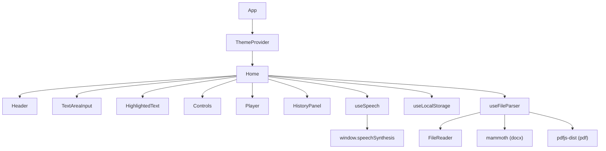

# Design Document: Voxify Advanced Features

## Overview

This document describes the technical design for eight advanced features added to the Voxify TTS web app. All features are implemented entirely client-side using the existing React 18 + TypeScript + Vite + Tailwind CSS + shadcn/ui stack. No backend changes are required.

The eight features are:
1. Text Highlight While Speaking
2. Save Voice Settings
3. Upload Text File (.txt, .rtf, .docx, .pdf)
4. Dark/Light Mode Toggle
5. Character Counter + Limit (5000 chars)
6. Resume from Pause
7. Repeat / Loop Mode
8. Speech History

---

## Architecture

The app follows a single-page component architecture. All state lives in `Home.tsx` and is passed down as props. The existing `useSpeech` hook is extended to support boundary events, loop mode, and a paused-state flag. A new `useLocalStorage` utility hook handles all persistence. A new `useFileParser` hook encapsulates file reading and parsing logic.



### Key Design Decisions

- **Boundary highlighting uses character offsets**: `SpeechSynthesisUtterance.onboundary` provides `charIndex` and `charLength`. The text is pre-tokenised into word spans with their start/end offsets so the active word can be found in O(n) on boundary events.
- **Loop mode via `onend` callback**: The `useSpeech` hook holds a `loopRef` boolean ref. When `onend` fires and `loopRef.current` is true, it re-invokes `speak()` with the same parameters.
- **Paused state is tracked separately from `isPlaying`**: A `isPaused` boolean state is added to `useSpeech` so the UI can distinguish paused from stopped.
- **File parsing is lazy-loaded**: `mammoth` and `pdfjs-dist` are dynamically imported only when a `.docx` or `.pdf` file is selected, keeping the initial bundle small.
- **`next-themes` ThemeProvider** wraps the app at the `main.tsx` level with `defaultTheme="dark"` and `storageKey="voxify_theme"`.

---

## Components and Interfaces

### Modified: `src/hooks/useSpeech.ts`

Extended return type:

```typescript
interface UseSpeechReturn {
  speak: (text: string, voice: string, rate: number, pitch: number, volume: number) => void;
  pause: () => void;
  resume: () => void;
  stop: () => void;
  isPlaying: boolean;
  isPaused: boolean;           // NEW
  availableVoices: SpeechSynthesisVoice[];
  activeWordIndex: number;     // NEW – charIndex of the currently spoken word
  loopMode: boolean;           // NEW
  setLoopMode: (v: boolean) => void; // NEW
}
```

The hook adds:
- `isPaused` state (true after `pause()`, false after `resume()` or `stop()`)
- `activeWordIndex` state updated on every `onboundary` event
- `loopRef` ref (boolean) checked in `onend` to restart speech
- `loopMode` state + `setLoopMode` setter

### New: `src/hooks/useLocalStorage.ts`

```typescript
function useLocalStorage<T>(key: string, defaultValue: T): [T, (val: T) => void]
```

Generic hook that reads from `localStorage` on mount, returns a setter that writes back on every call, and handles JSON parse errors by falling back to `defaultValue`.

### New: `src/hooks/useFileParser.ts`

```typescript
interface UseFileParserReturn {
  parseFile: (file: File) => Promise<string>;
  isParsing: boolean;
  parseError: string | null;
}
```

Handles `.txt`, `.rtf` (via `FileReader.readAsText`), `.docx` (via dynamic import of `mammoth`), and `.pdf` (via dynamic import of `pdfjs-dist`). Enforces the 5 MB file size limit before reading.

### Modified: `src/components/TextArea.tsx`

- Accepts `maxLength={5000}` and `highlightedWordIndex` prop
- Renders a character counter with colour-coded warning states
- Adds a file upload button (hidden `<input type="file">` triggered by a styled button)
- When `isPlaying` is true, renders a read-only highlighted word view alongside (or replacing) the plain textarea

### New: `src/components/HighlightedText.tsx`

Renders the text as a series of `<span>` elements, one per word, with spaces between. The span whose character range contains `activeWordIndex` receives the highlight class.

```typescript
interface Props {
  text: string;
  activeWordIndex: number; // -1 means no highlight
}
```

### Modified: `src/components/Player.tsx`

- Adds a Loop toggle button (icon: `Repeat`) that calls `setLoopMode`
- Distinguishes paused state visually: Play button label changes to "Resume" when `isPaused` is true
- Play handler: if `isPaused`, calls `resume()`; otherwise calls `speak()`

### Modified: `src/components/Controls.tsx`

No structural changes. Receives the same props. VoiceSettings persistence is handled in `Home.tsx` via `useLocalStorage`.

### New: `src/components/HistoryPanel.tsx`

Collapsible panel (using shadcn/ui `Collapsible`) showing up to 10 history entries. Each entry has a "load" button and a "delete" button.

```typescript
interface Props {
  history: string[];
  onSelect: (text: string) => void;
  onDelete: (index: number) => void;
}
```

### Modified: `src/pages/Home.tsx`

- Wraps voice/rate/pitch/volume state initialisation with `useLocalStorage`
- Persists settings on every change via the `useLocalStorage` setter
- Manages `speechHistory` state via `useLocalStorage`
- Adds history entry on every `speak()` call
- Passes `loopMode`, `setLoopMode`, `isPaused`, `activeWordIndex` down to child components
- Renders `HighlightedText` when `isPlaying || isPaused`
- Renders `HistoryPanel`

### Modified: `src/main.tsx`

Wraps `<App />` with `<ThemeProvider attribute="class" defaultTheme="dark" storageKey="voxify_theme">`.

### Modified: `src/components/Header.tsx`

Adds a dark/light mode toggle button using `useTheme()` from `next-themes`.

---

## Data Models

### VoiceSettings (LocalStorage key: `voxify_voice_settings`)

```typescript
interface VoiceSettings {
  voice: string;   // SpeechSynthesisVoice.name
  rate: number;    // 0.5 – 2.0
  pitch: number;   // 0.5 – 2.0
  volume: number;  // 0.0 – 1.0
}
```

### SpeechHistory (LocalStorage key: `voxify_speech_history`)

```typescript
type SpeechHistory = string[]; // max 10 entries, index 0 = most recent
```

### WordToken (in-memory, not persisted)

```typescript
interface WordToken {
  word: string;
  start: number; // charIndex in the full text string
  end: number;   // start + word.length
}
```

Used by `HighlightedText` to map `activeWordIndex` to the correct span.

---

## Correctness Properties

*A property is a characteristic or behavior that should hold true across all valid executions of a system — essentially, a formal statement about what the system should do. Properties serve as the bridge between human-readable specifications and machine-verifiable correctness guarantees.*

### Property 1: VoiceSettings round-trip

*For any* valid `VoiceSettings` object, serialising it to JSON and deserialising it should produce an object equal to the original.

**Validates: Requirements 2.1, 2.2, 2.5**

### Property 2: VoiceSettings default fallback

*For any* invalid or missing LocalStorage value for `voxify_voice_settings`, `useLocalStorage` should return the provided default value unchanged.

**Validates: Requirements 2.3, 2.4**

### Property 3: SpeechHistory round-trip

*For any* array of strings stored as `voxify_speech_history`, serialising and deserialising should produce an array equal to the original.

**Validates: Requirements 8.2, 8.8**

### Property 4: SpeechHistory length invariant

*For any* sequence of `addToHistory` calls, the resulting history array should never exceed 10 entries.

**Validates: Requirements 8.3**

### Property 5: SpeechHistory deduplication at head

*For any* history array and any text string that is already the most recent entry, calling `addToHistory` with that string should leave the history array unchanged.

**Validates: Requirements 8.1**

### Property 6: Character limit enforcement

*For any* string of length greater than 5000, applying the character limit truncation should produce a string of exactly 5000 characters.

**Validates: Requirements 5.6, 3.6**

### Property 7: Word tokenisation coverage

*For any* non-empty text string, the set of `WordToken` objects produced by the tokeniser should cover every non-whitespace character in the original string exactly once (no gaps, no overlaps).

**Validates: Requirements 1.1, 1.2**

### Property 8: Active word index containment

*For any* text string and any `charIndex` value in the range `[0, text.length)`, the word token whose range contains `charIndex` should be the unique token where `token.start <= charIndex < token.end`.

**Validates: Requirements 1.2, 1.3**

### Property 9: Loop mode does not fire on stop

*For any* speech session with loop mode enabled, calling `stop()` should result in `isPlaying` being false and no new utterance being started.

**Validates: Requirements 7.4**

### Property 10: Counter colour state transitions

*For any* character count value, the counter colour state should be `neutral` when count < 4500, `warning` when 4500 ≤ count < 5000, and `error` when count ≥ 5000.

**Validates: Requirements 5.3, 5.4, 5.5**

---

## Error Handling

| Scenario | Handling |
|---|---|
| `onboundary` not fired by browser | Text renders without highlighting; speech continues normally (Req 1.6) |
| LocalStorage read throws (e.g. private mode quota) | Catch, log, use default value |
| LocalStorage write throws | Catch, log, show toast warning |
| File > 5 MB | Reject before reading, show error toast (Req 3.5) |
| File read error (FileReader `onerror`) | Show descriptive error toast, leave textarea unchanged (Req 3.7) |
| `.docx` parse error (mammoth) | Show error toast, leave textarea unchanged |
| `.pdf` parse error (pdfjs-dist) | Show error toast, leave textarea unchanged |
| Extracted text > 5000 chars | Truncate to 5000, show warning toast (Req 3.6) |
| `SpeechSynthesis` unavailable | Existing toast error in `useSpeech` covers this |
| `resume()` called with no paused utterance | Fall through to `speak()` from beginning (Req 6.5) |
| Invalid JSON in `voxify_speech_history` | Discard, initialise as `[]` (Req 8.8) |

---

## Testing Strategy

### Unit Tests (Vitest)

Unit tests cover specific examples, edge cases, and pure utility functions:

- `useLocalStorage`: default value on missing key, default value on corrupt JSON, round-trip read/write
- `addToHistory`: deduplication at head, max-length trimming, empty history initialisation
- `tokeniseWords`: empty string, single word, multiple words, punctuation attached to words
- `getActiveTokenIndex`: exact boundary match, charIndex at start, charIndex at end, charIndex out of range
- `getCounterState`: boundary values 0, 4499, 4500, 4999, 5000, 5001
- `truncateToLimit`: string shorter than limit unchanged, string at limit unchanged, string over limit truncated

### Property-Based Tests (fast-check, minimum 100 iterations each)

Property tests validate universal correctness across randomly generated inputs. The library chosen is **[fast-check](https://github.com/dubzzz/fast-check)** — a mature, TypeScript-native property-based testing library with no additional runtime dependencies.

Each property test is tagged with a comment in the format:
`// Feature: voxify-advanced-features, Property N: <property text>`

- **Property 1** – VoiceSettings round-trip: generate random `VoiceSettings`, serialise → deserialise, assert deep equality
- **Property 2** – VoiceSettings default fallback: generate random non-JSON strings and `null`, assert `useLocalStorage` returns default
- **Property 3** – SpeechHistory round-trip: generate random string arrays, serialise → deserialise, assert deep equality
- **Property 4** – SpeechHistory length invariant: generate random sequences of `addToHistory` calls, assert `history.length <= 10`
- **Property 5** – SpeechHistory deduplication at head: generate history + duplicate head entry, assert history unchanged
- **Property 6** – Character limit enforcement: generate strings of length > 5000, assert truncated length === 5000
- **Property 7** – Word tokenisation coverage: generate random strings, assert tokens cover all non-whitespace chars exactly once
- **Property 8** – Active word index containment: generate text + charIndex in range, assert exactly one token contains it
- **Property 9** – Loop mode stop invariant: simulate stop() call, assert no restart regardless of loop state
- **Property 10** – Counter colour state transitions: generate counts across full integer range, assert correct colour state

### Integration Notes

- The `ThemeProvider` integration is verified by a snapshot test of `main.tsx` render output
- File parsing is tested with fixture files (a small `.txt`, `.rtf`, `.docx`, `.pdf`) stored in `src/__fixtures__/`
- The `HistoryPanel` is tested with React Testing Library for load and delete interactions
